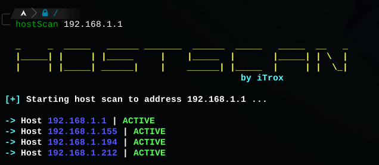

# **hostScan**

Small bash script, whose function is to detect devices connected to a class C network, by sending ICMP traces via ping.

* To use the tool at the system level from a relative path, it is recommended to create a symbolic link to the /usr/bin directory

    + sudo ln -s /path/to/my/file/hostScan.sh /usr/bin/hostScan

## Use

- hostScan <ip_address>

**Script subject to change.**
