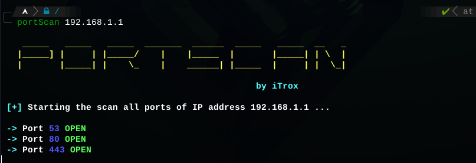

# **portScan**

Small bash script, whose function is to scan open ports on a host, by sending empty strings through /dev/tcp.

* To use the tool at the system level from a relative path, it is recommended to create a symbolic link to the /usr/bin directory

    + sudo ln -s /path/to/my/file/portScan.sh /usr/bin/portScan

## Use

- portScan <ip_address>

