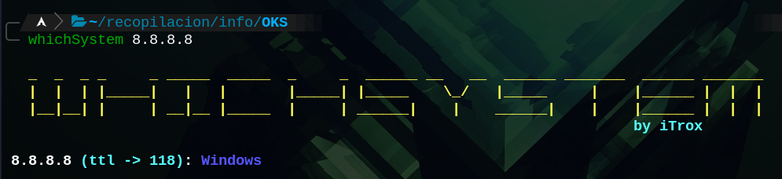
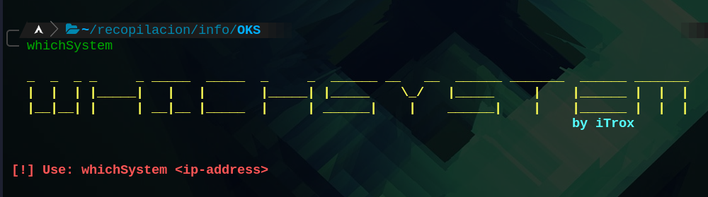

# **whichSystem**

Small bash script, whose function is by sending an ICMP packet and interpreting the response TTL value, to know if the target system corresponds to a Windows or Linux system.

* To use the tool at the system level from a relative path, it is recommended to create a symbolic link to the /usr/bin directory.

    + sudo ln -s /path/to/my/file/whichSystem.sh /usr/bin/whichSystem

## Use

- whichSystem <ip_address or domain>

**Script subject to change.**
